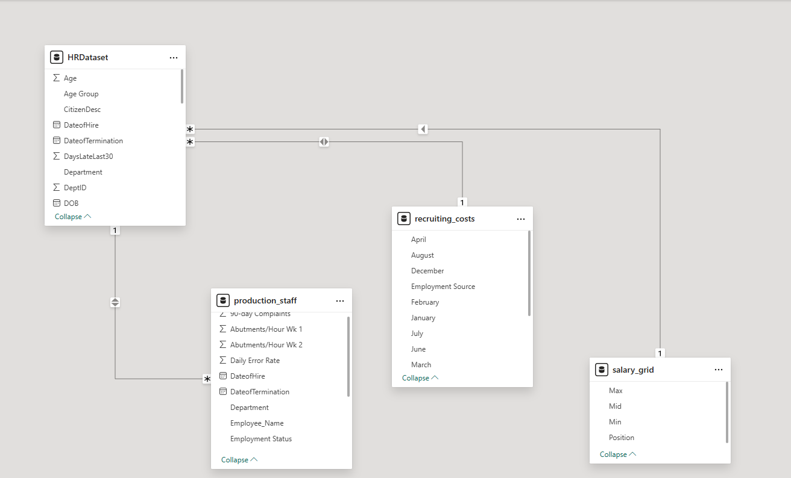
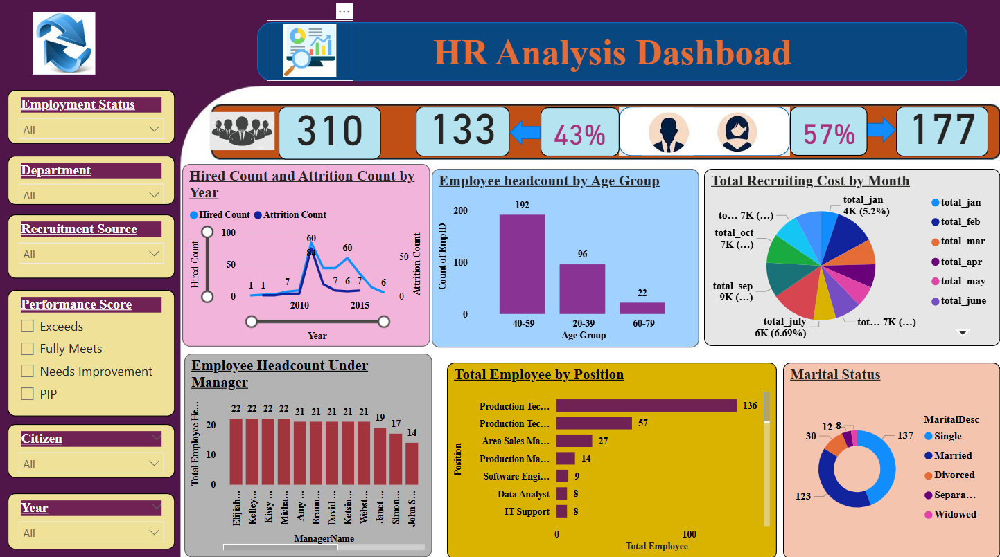
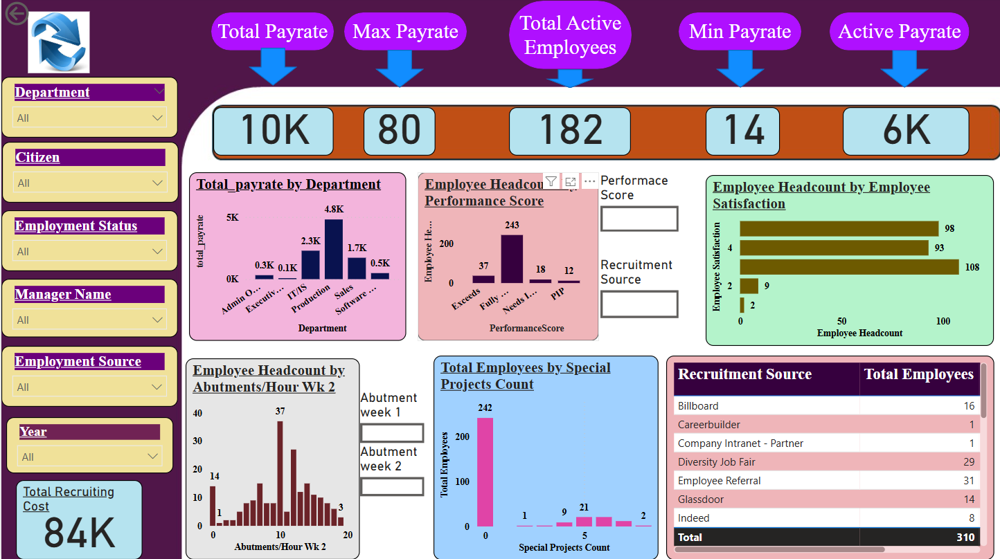
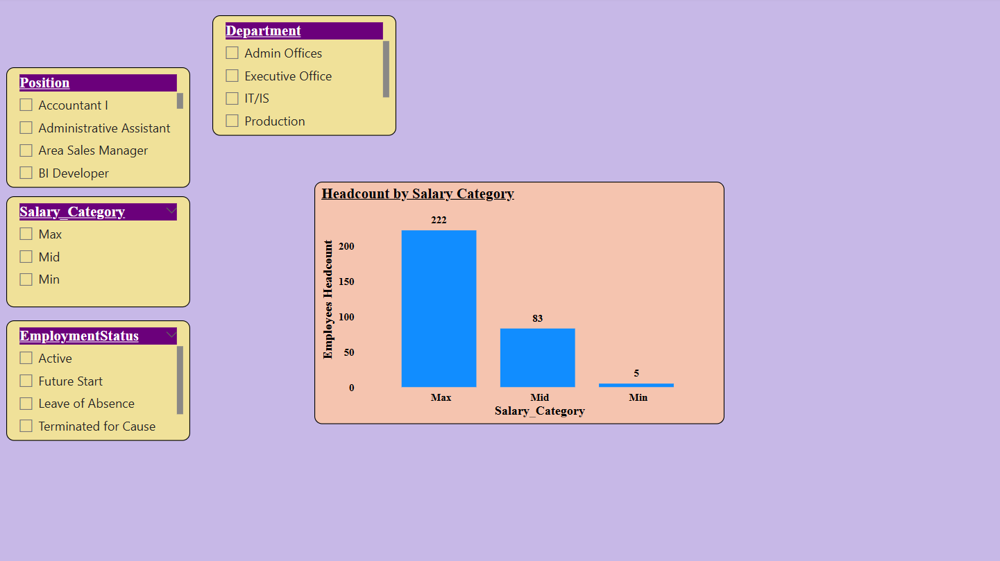

# HR Data Analysis

1. HR Data Analysis involves collecting, processing, and interpreting employee-related data to enhance decision-making.  
2. It helps organizations track key HR metrics like employee turnover, retention rates, and performance.  
3. By using data analytics, HR professionals can identify trends and patterns that impact workforce management.  
4. It supports talent acquisition by assessing hiring efficiency and candidate quality.  
5. HR analytics also aids in predicting future workforce needs through data-driven insights.  
6. Employee engagement and satisfaction can be measured using surveys and feedback analysis.  
7. Predictive analytics helps in reducing attrition by identifying at-risk employees.  
8. Workforce productivity and efficiency can be optimized by analyzing work patterns.  
9. HR Data Analysis ensures compliance by monitoring policies and regulations.  
10. Ultimately, it enables organizations to make strategic, evidence-based HR decisions.  

# About Datasets  

## **1. HR Dataset**  
This dataset contains detailed employee information, including demographics, performance, and employment status. It is crucial for analyzing employee retention, engagement, and compensation trends.  

### **Key Columns:**  
- **EmployeeID** – Unique identifier for each employee.  
- **Name** – Employee’s full name.  
- **Department** – The department in which the employee works.  
- **JobTitle** – The employee’s position within the company.  
- **HireDate** – Date when the employee was hired.  
- **TerminationDate** – Date when the employee left the company (if applicable).  
- **Employment Status** – Whether the employee is active, terminated, or on leave.  
- **Performance Score** – Employee’s performance rating based on internal evaluations.  
- **Engagement Survey Score** – Employee engagement level, useful for analyzing satisfaction and retention.  
- **PayRate** – The salary or hourly wage of the employee.  

### **Use Cases:**  
- Identifying employees at risk of leaving based on performance and engagement trends.  
- Analyzing salary distribution and pay equity.  
- Examining workforce diversity and inclusion efforts.  

---

## **2. Production Staff Dataset**  
This dataset focuses on employees working in production roles, capturing productivity and performance metrics. It helps HR and management analyze workforce efficiency.  

### **Key Columns:**  
- **EmployeeID** – Unique identifier linked to the HR dataset.  
- **Department** – Production department where the employee works.  
- **AbutmentsPerHour** – The number of tasks/products completed per hour.  
- **ErrorRate** – The percentage of defective or incorrect products produced.  
- **Performance Score** – Individual performance rating in the production environment.  
- **Days Late in Last 30 Days** – Measures attendance trends and punctuality.  

### **Use Cases:**  
- Identifying high-performing vs. low-performing employees.  
- Analyzing the impact of absenteeism on productivity.  
- Providing insights for workforce training and development.  

---

## **3. Recruiting Costs Dataset**  
This dataset tracks recruitment-related expenses, helping HR assess cost efficiency in hiring strategies.  

### **Key Columns:**  
- **RecruitmentSource** – The channel used for hiring (e.g., job portals, employee referrals, recruitment agencies).  
- **Month** – The month for which recruitment costs are recorded.  
- **Total Cost** – The total expenses associated with each recruitment source for that month.  

### **Use Cases:**  
- Comparing the cost-effectiveness of different hiring channels.  
- Identifying the sources that result in high retention and performance.  
- Optimizing recruitment budgets to focus on the most successful hiring methods.  

---

## **4. Salary Grid Dataset**  
This dataset defines salary structures for different job roles, allowing HR to analyze pay equity and industry benchmarking.  

### **Key Columns:**  
- **JobTitle** – The role for which the salary range applies.  
- **MinSalary** – The lowest salary offered for the position.  
- **MidSalary** – The average or benchmark salary for the role.  
- **MaxSalary** – The highest salary range for the position.  

### **Use Cases:**  
- Identifying underpaid or overpaid employees based on their job title.  
- Ensuring fair and competitive compensation within the organization.  
- Supporting HR in making data-driven salary adjustment decisions.  

---
# **Business Insights from HR Datasets**

## **1. Employee Demographics & Retention**
- **High Turnover in Production:** A significant number of employee terminations occur in the **Production** department, suggesting job dissatisfaction or operational challenges.  
- **Diversity Gaps:** The workforce is predominantly **White**, indicating the need for stronger diversity and inclusion efforts.  
- **Recruitment Source Effectiveness:** **Employee referrals** are the primary hiring source, demonstrating the effectiveness of internal networking in attracting talent.  

## **2. Compensation & Pay Rate Analysis**
- **Salary Disparity:** Employee salaries range from **$14/hour to $80/hour**, suggesting potential pay inequity concerns that need to be addressed.  
- **Production Pay vs. Performance:** Higher salaries in production roles correlate with better performance, implying that competitive wages can enhance efficiency.  

## **3. Recruitment Cost Efficiency**
- **Uneven Recruitment Spending:** Some recruitment channels cost up to **$10,980 annually** but contribute minimally to new hires. Optimizing budget allocation can improve cost efficiency.  
- **Hiring Peaks:** Recruitment efforts peak in **February, August, and September**, allowing HR to plan ahead for seasonal hiring trends.  

## **4. Performance & Productivity Trends**
- **Engagement vs. Satisfaction Gap:** Engagement scores (3.33) are lower than satisfaction scores (3.89), highlighting a need to improve workplace engagement initiatives.  
- **Production Performance Metrics:**  
  - **Abutments per Hour** improved from **9.5 to 10.2**, reflecting increased efficiency.  
  - **Error Rate:** Averages **0.9 errors per day**, signaling opportunities to enhance quality control.  

## **5. Salary Grid & Compensation Strategy**
- **Role-Based Pay Gaps:**  
  - The average **midpoint salary** is **$30.81/hour**, which may require adjustments for pay equity.  
  - Structured **pay bands** can help standardize salaries and minimize disparities.  
- **Need for Compensation Review:** The **large pay gap** among roles calls for periodic salary benchmarking to ensure fair compensation.  

## **Strategic Recommendations**
✔ **Optimize recruitment spending** by focusing on high-yield sources like employee referrals.  
✔ **Improve retention in production** through better compensation, career growth opportunities, and workplace enhancements.  
✔ **Enhance engagement initiatives** to bridge the gap between engagement and satisfaction scores.  
✔ **Strengthen diversity hiring** to create a more inclusive workforce.  
✔ **Implement quality control measures** in production to reduce errors and boost efficiency.  

# Dashboards

## **Entity-Relationship Diagram**  

The following ER diagram represents the relationship between employees, departments, recruitment costs, and salary structures.  

  
 
 

